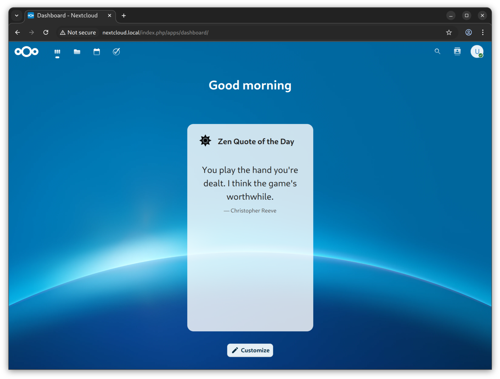
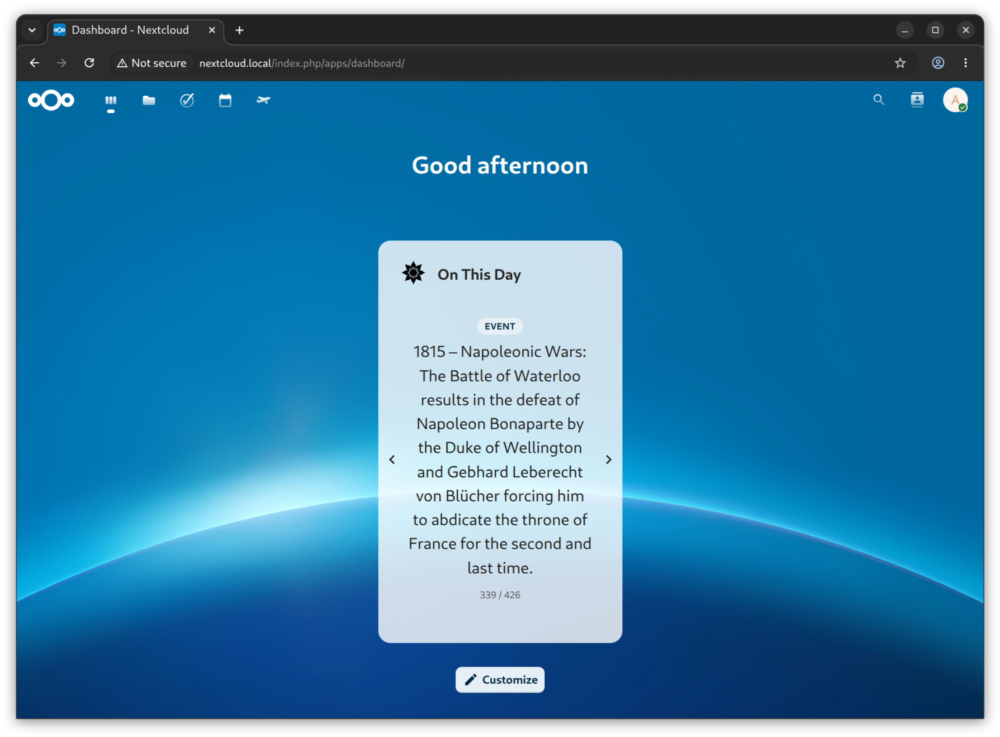
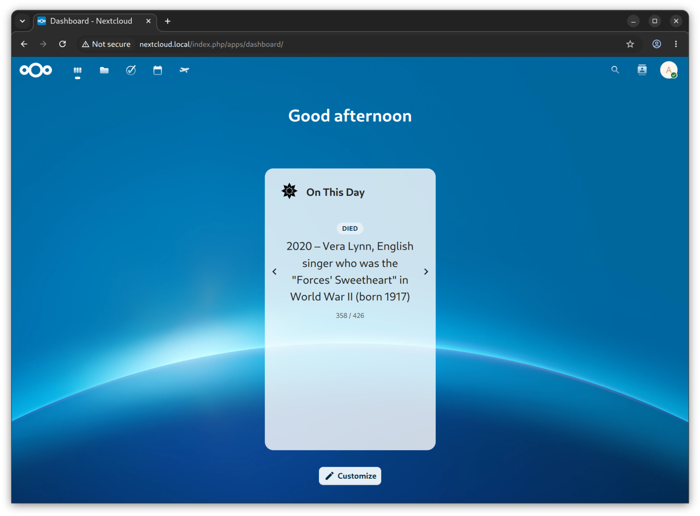
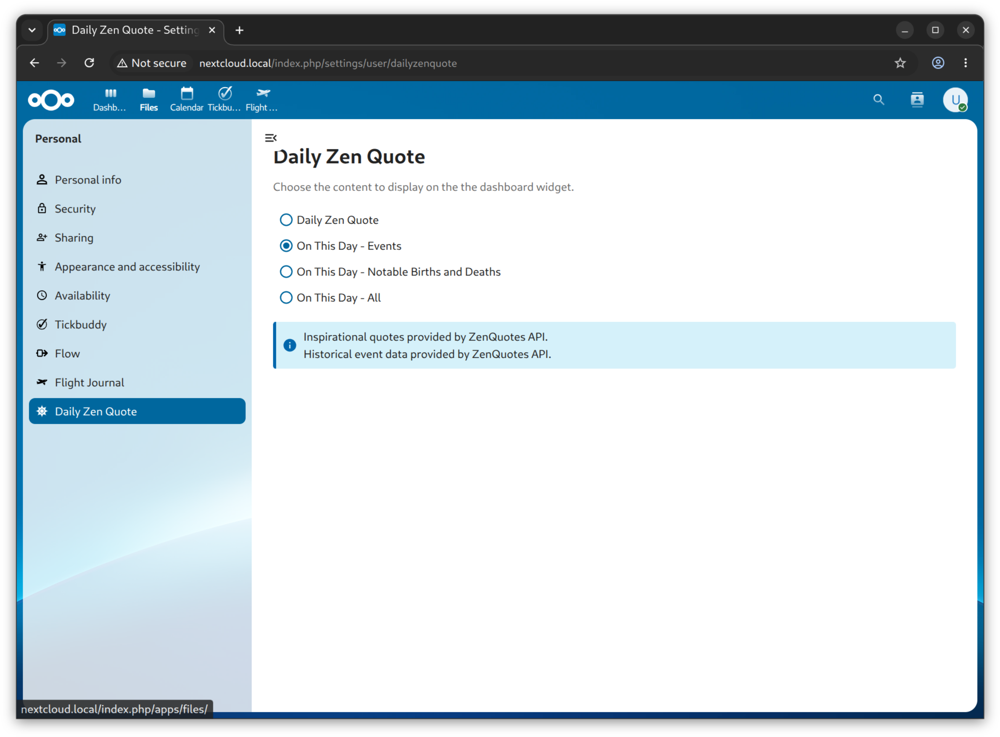

# Daily Zen Quote

A simple Nextcloud dashboard widget which shows either an inspirational quote or notable historical events, births and deaths on the calendar day. This can be configured is the user's Personal Settings. The quotes and events come from [ZenQuotes.io](https://zenquotes.io/) using the [featured daily quote API](https://docs.zenquotes.io/zenquotes-documentation/#call-today) and the [On This Day API](https://docs.zenquotes.io/on-this-day-api-documentation/).

***Attribution***
Inspirational quotes provided by [ZenQuotes API](https://zenquotes.io/).

Historical event data provided by [ZenQuotes API](https://zenquotes.io/).

### Motivation

This is a personal hobby project which I am using to learn about Nextcloud app development and AI-assisted development. Significant portion of the code has been written by Claude Code.

### Found a bug? Have a feature suggestion?

Feel free to get in touch and/or submit an issue.

### Screenshot

Inspirational zen quote:

On This Day

Settings

